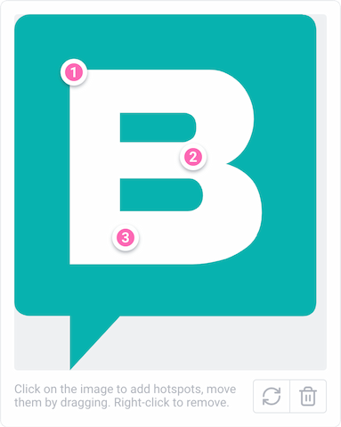

# Storyblok Hotspots 🎯

A custom field for [Storyblok](https://www.storyblok.com/) to place hotspots on an image.



# Rationale

Annotating images is a classic use-case for custom Storyblok fields and there is even an official [tutorial](https://www.storyblok.com/tp/how-to-create-a-simple-image-map-with-storyblok) on how to create such fields, including an [example](https://github.com/storyblok/field-type-examples/tree/main/annotated-image) implementation based on the legacy field plugin API which is tightly coupled to an old Vue version.

This plugin though has been created from scratch using the [new field plugin SDK](https://www.storyblok.com/docs/plugins/field-plugins/introduction) which makes it easy to install and deploy.

# Installation

Clone the repository and run:

```
npm install
npm run deploy
```

Follow the instructions in your terminal to deploy the plugin to the partner portal or your personal profile.

# Usage

The value generated by the field looks like this:

```json
{
  "image": {
    "filename": "https://plugin-sandbox.storyblok.com/icon.svg"
  },
  "hotspots": [
    {
      "x": 0.321,
      "y": 0.217
    },
    {
      "x": 0.5483,
      "y": 0.404
    },
    {
      "x": 0.4091,
      "y": 0.6209
    }
  ]
}
```

The x/y coordinates are values between 0 and 1, with `{x: 0, y: 0}` being the top-left corner and `{x: 1, y: 1}` the bottom-right corner of the image.

> [!NOTE]
> The field does not handle any content you might want to display when interacting with the hotspots, it only deals with the coordinates. In order to manage the associated content, use a separate _Blocks_ field.

## Options

You can change the color of the hotspots to match your brand by setting the `color` option to any valid CSS color value.

# License

MIT
